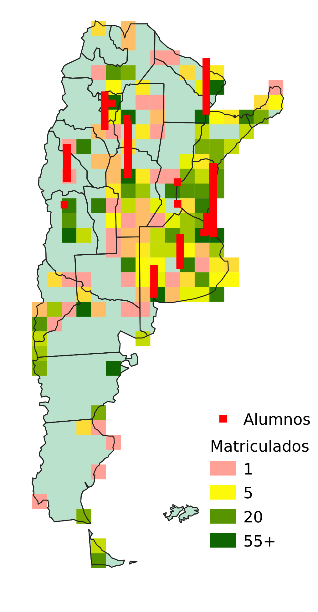
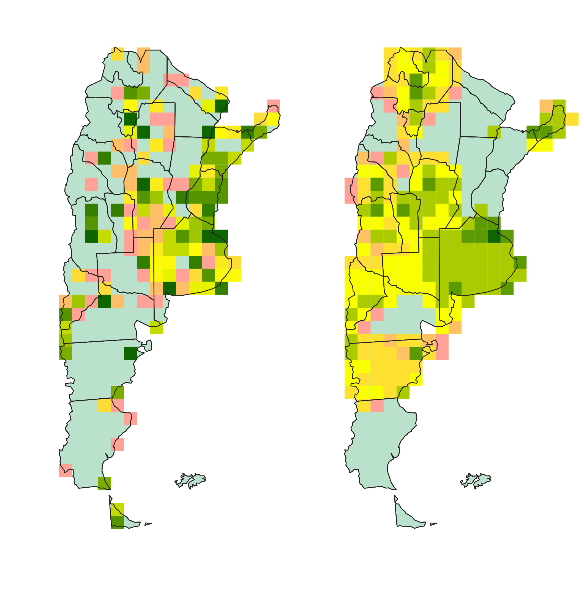
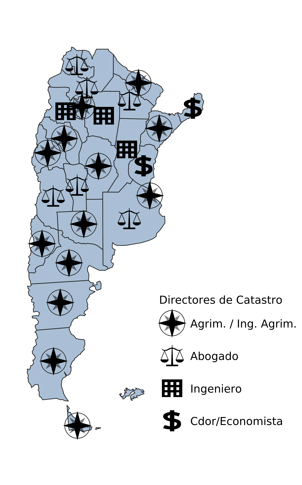

# Mapas

En la presentación realizada en mendoza en octubre de 2019, se mostraron algunos ejemplos de mapas elaborados con los datos recolectados.

A continuación, sin demaciado cambio, se incluyen los mapas estáticos incluidos.

# Mapa de Matriculados y Alumnos Activos en Universidades

Este mapa se generó utilizando la información que está en los geopackages de Grillas.gpkg y universidades.gpkg que pueden [descargarse aquí](https://github.com/jjclavijo/fedagrim/tree/data/gpkg).

::: estatico

::::::::::::

# Mapas de Matriculados y Cantidad de parcelas por unidad de superficie.

Los mapas que siguen, utilizando una escala de colores similar a la anterior, compara la cantidad de parcelas en el catastro provincial con la cantidad de matriculados. Si bien la comparación es puramente gráfica y no se incluyó una leyenda para especificar la magnitud de los valores representados, da una idea de la información con la que se cuenta.

::: estatico

::::::::::::

# Profesion de los directores de catastro.

En este mapa se representó la información obtenida de la web de Consejo Federal del Catastro acerca de la profesión de cada director porvincial de catastro. En algunos casos "ingeniero" podría ser equivalente a "ingeniero agrimensor", no se lo identificó de ese modo a menos que lo dijera expresamente la fuente.

::: estatico

::::::::::::

# Menciones en las leyes de catastro.

Los mapas mostrados en la presentación comparando las menciones de determinados términos en las leyes provinciales de catastro corresponden a una visualización interactiva construida utilizando Leaflet.js a partir de la información procesada tal como se explica en: [Proyecto contar-leyes](https://github.com/jjclavijo/contar-leyes#an%C3%A1lisis-de-leyes-de-catastro-por-conteo-de-palabras)

Pueden verse los mapas interactivos en los links que siguen: [Mapas con dos palabras](./lftest.html) y [Mapas con una palabra](./lftest1.html)
